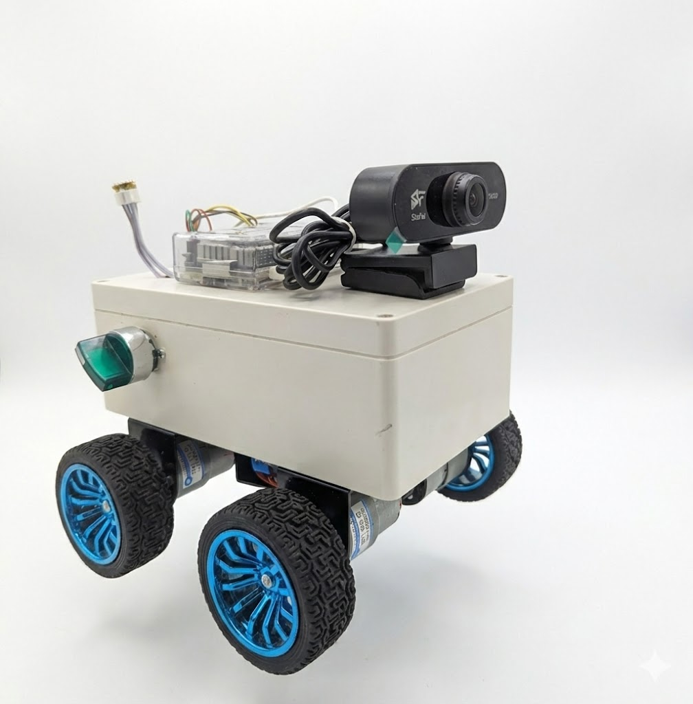

# Mobile Robot Project 

## Describe:
Get inspired by a Vietnamese television series, i will create a project of mobile robot that can comunicate like an AI and control devices in your house 

## Components:
* Raspberrypi 4
* Max9835A Speaker Module
* INMP441 Micro Module
* Arduino Uno
* GA25 12v DC motor
* Lipo battery  
* LM2596 buck module dc-dc
* XL4015 buck module dc-dc

Image source: https://randomnerdtutorials.com/raspberry-pi-pinout-gpios/

## Connection:

### Raspberrypi connection 
| Raspberry Pi Pin        | Function        | MAX98357A (Speaker) | INMP441 (Microphone) | Camera          |
|-------------------------|-----------------|---------------------|----------------------|-----------------|
| GPIO 18 (Pin 12)        | Bit Clock       | BCLK Pin            | SCK Pin              | (Not connected) |
| GPIO 19 (Pin 35)        | Word Select     | LRC Pin             | WS Pin               | (Not connected) |
| GPIO 19 (Pin 35)        | Word Select     | LRC Pin             | WS Pin               | (Not connected) |
| GPIO 21 (Pin 40)        | Data OUT        | DIN Pin             | (Not connected)      | (Not connected) |
| GPIO 20 (Pin 38)        | Data IN         | (Not connected)     | SD Pin               | (Not connected) |
| 5V                      | Speaker Power   | Vin                 | (Not connected)      | (Not connected) |
| 3.3V                    | Microphone Power| (Not connected)     | VDD                  | (Not connected) |
| GND                     | Ground          | GND                 | GND and L/R          | (Not connected) |
| USB 3.0 (1)             | Image Transfer  | (Not connected)     | (Not connected)      | USB             |

### Arduino connection 
| Arduino Pin        | L298N_1              | L298N_2          | LM2596           |
|--------------------|----------------------|------------------|------------------|
| d2                 | INT1                 | (Not connected)  | (Not connected)  |
| d3                 | INT2                 | (Not connected)  | (Not connected)  |
| d4                 | INT3                 | (Not connected)  | (Not connected)  |
| d5                 | INT4                 | (Not connected)  | (Not connected)  |
| d6                 | (Not connected)      | INT1             | (Not connected)  |
| d7                 | (Not connected)      | INT2             | (Not connected)  |
| d8                 | (Not connected)      | INT3             | (Not connected)  |
| d11                | (Not connected)      | INT4             | (Not connected)  |
| d9                 | PWM Pin              | (Not connected)  | (Not connected)  |
| d10                | (Not connected)      | PWM Pin          | (Not connected)  |
| 5V                 | (Not connected)      | (Not connected)  | OUT+             |
| GND                | (Not connected)      | (Not connected)  | OUT-             |

### Power supply 
| Lipo battery       | L298N_1              | L298N_2          | LM2596           | XL4015           |
|--------------------|----------------------|------------------|------------------|------------------|
| +                  | 12v                  | 12v              | IN+              | IN+              |
| -                  | GND                  | GND              | IN-              | IN-              |

| LM2596             | Arduino Uno          |
|--------------------|----------------------|
| OUT+               | 5v                   |
| OUT-               | GND                  |

| XL4015             | Raspberry Pi         |
|--------------------|----------------------|
| OUT+               | +USBc power supply   |
| OUT-               | -USBc power supply   |
## Core:
* AI Model: local ai from olama with modek qwen2.5, version: 1.5b
* Devices Communication Protocol: MQTT

## Result:
* Week1 (start: 1/4/2026): Can communicate as a child and can separate the request of communication and control device.
* Week2 (start: 1/12/2026): Can update news and weather in a location
* Week3 (start: 1/19/2026): Complete the hardware assembly, web server control interface and imtegrate cammera with raspberrypi.
* Week 4 (start: 1/26/2026): Updated motors moving control and combine camera tracking with motors 