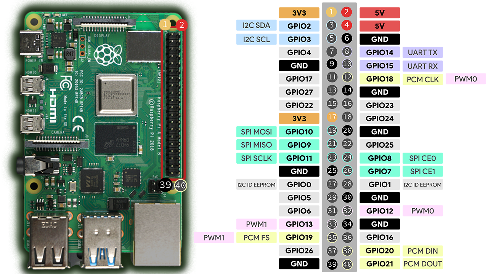

# Mobile Robot Project 

## Describe:
Get inspired by a Vietnamese television series, i will create a project of mobile robot that can comunicate like an AI and control devices in your house 

## Components:
* Raspberrypi 4
* Max9835A Speaker Module
* INMP441 Micro Module
* Arduino Uno
* GA25 12v DC motor
* Lipo battery  
* LM2596 buck module dc-dc
* XL4015 buck module dc-dc

Image source: https://randomnerdtutorials.com/raspberry-pi-pinout-gpios/

## Connection:
| Raspberry Pi Pin        | Function        | MAX98357A (Speaker) | INMP441 (Microphone) |
|-------------------------|-----------------|---------------------|----------------------|
| GPIO 4 (Pin 37)         | Data IN         | SD pin              | (Not connected)      |
| GPIO 18 (Pin 12)        | Bit Clock       | BCLK Pin            | SCK Pin              |
| GPIO 19 (Pin 35)        | Word Select     | LRC Pin             | WS Pin               |
| GPIO 21 (Pin 40)        | Data OUT        | DIN Pin             | (Not connected)      |
| GPIO 20 (Pin 38)        | Data IN         | (Not connected)     | SD Pin               |
| 5V                      | Speaker Power   | Vin                 | (Not connected)      |
| 3.3V                    | Microphone Power| (Not connected)     | VDD                  |
| GND                     | Ground          | GND                 | GND and L/R          |

## Core:
* AI Model: local ai from olama with modek qwen2.5, version: 1.5b
* Devices Communication Protocol: MQTT

## Result:
* 1/11/2026: Can communicate as a child and can separate the request of communication and control device.
* 1/14/2026: Can update news and weather in a location
* 1/18/2026: Complete the hardware assembly.